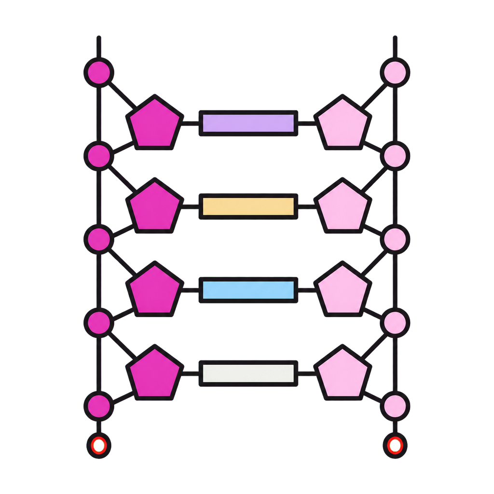
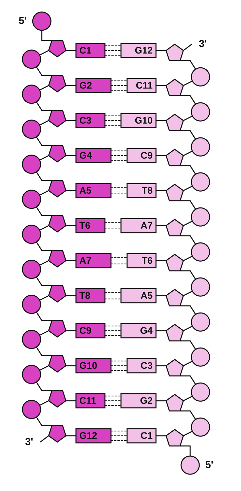
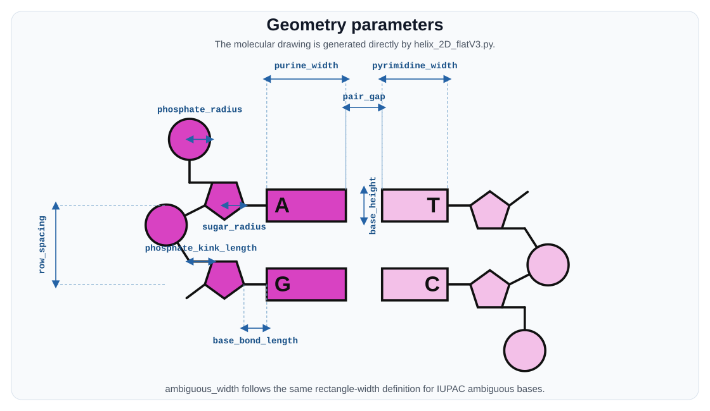

# Helix 2D Flat



Helix 2D Flat creates publication-friendly, flat 2D SVG drawings of DNA and
RNA duplexes. Give it one strand in the 5' to 3' direction; the program
computes the antiparallel complement and draws phosphates, pentose sugars,
bases, backbone bonds, residue numbers, and terminal labels.

The project provides both a Tkinter graphical interface and a command-line
interface. It has no third-party runtime dependencies.



## Features

- DNA and RNA complement generation, including IUPAC ambiguous bases
- Plain sequence, text-file, and FASTA input
- GUI and command-line workflows
- Configurable colors, strand direction, dimensions, labels, and background
- Optional schematic hydrogen-bond lines
- Scalable SVG output suitable for figures and further editing

## Requirements

- Python 3.9 or newer
- Tkinter for the GUI

Tkinter is included with the standard Python installers for Windows and
macOS. On Debian/Ubuntu Linux, install it with:

```bash
sudo apt install python3-tk
```

## Quick Start

Clone the repository and open the GUI:

```bash
git clone https://github.com/DiLiuLab/helix-2d-flat.git
cd helix-2d-flat
python3 helix_2D_flatV3.py
```

Generate an SVG from the command line:

```bash
python3 helix_2D_flatV3.py CGCGCGCGCGCG -o duplex.svg
```

Use a FASTA or text file:

```bash
python3 helix_2D_flatV3.py --input sequence.fasta
```

The default file output is `helix_2D_flatV3_out.svg` for a direct sequence,
or `<input-name>_helix2d.svg` for file input.

## Useful Options

```bash
python3 helix_2D_flatV3.py AUGCUA \
  --nucleic-acid rna \
  --input-chain right \
  --left-direction bottom-to-up \
  --show-base-pair-lines \
  --transparent \
  -o rna_duplex.svg
```

Run `python3 helix_2D_flatV3.py --help` for all geometry, color, label, and
terminal-style controls.

## Parameter Definitions

The figure below is generated from the script itself and shows the main
geometry parameters. `ambiguous_width` follows the same rectangle-width
definition as `purine_width` and `pyrimidine_width`.



Regenerate the figure after geometry changes with
`python3 scripts/generate_parameter_figure.py`.

## Make the Script Executable

On macOS or Linux:

```bash
chmod +x helix_2D_flatV3.py
./helix_2D_flatV3.py
```

This still requires Python and Tkinter on the computer.

`helix_2D_flatV3.py` is intentionally self-contained and can be copied and
run without the rest of the repository. The GUI will simply omit its custom
icon if the `assets` directory is not present.

## Build a Standalone Application

PyInstaller can create an application that users can launch without invoking
Python directly. Build on each target operating system; PyInstaller does not
cross-compile.

```bash
python3 -m venv .venv
source .venv/bin/activate
python -m pip install -r requirements-dev.txt
pyinstaller --clean --noconfirm Helix2DFlat.spec
```

Windows activation uses `.venv\Scripts\activate` instead. Build outputs are
written to `dist/`:

- macOS: `Helix 2D Flat.app`
- Windows: `Helix2DFlat.exe`
- Linux: `Helix2DFlat`

The supplied specification bundles the taskbar/Dock icon and uses windowed
mode so the GUI does not open an extra console. To retain CLI use, run the
Python script directly or make a separate console-enabled PyInstaller build.

## Testing

```bash
python3 -m unittest discover -s tests -v
```

## License

Released under the [MIT License](LICENSE).
